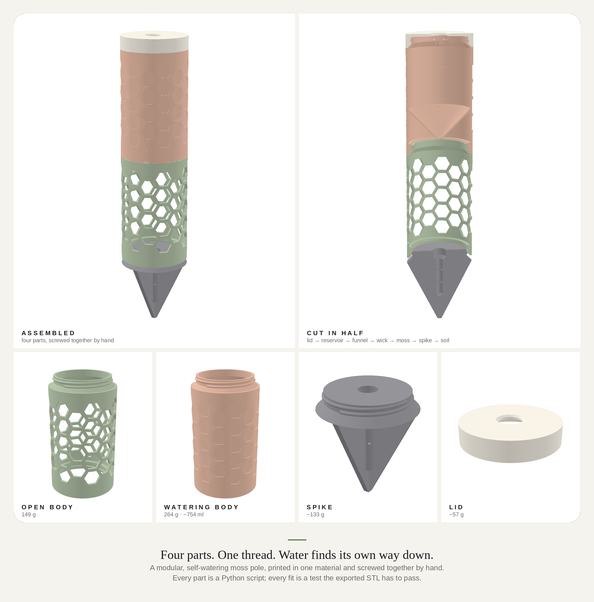
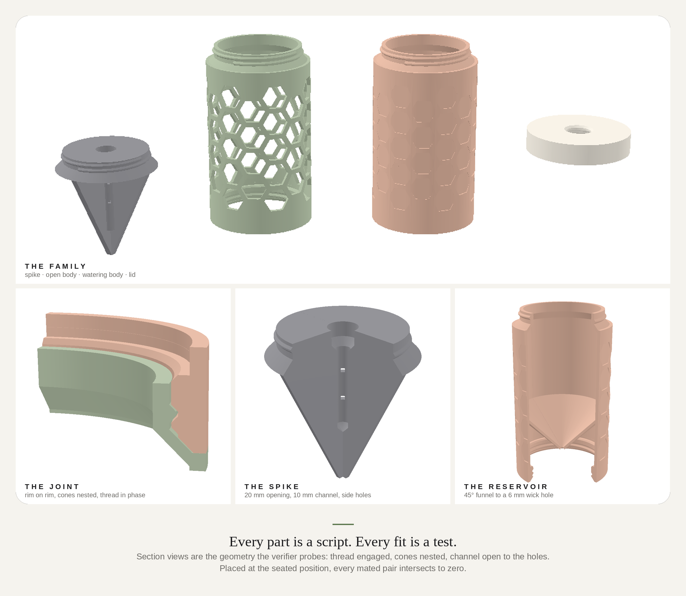
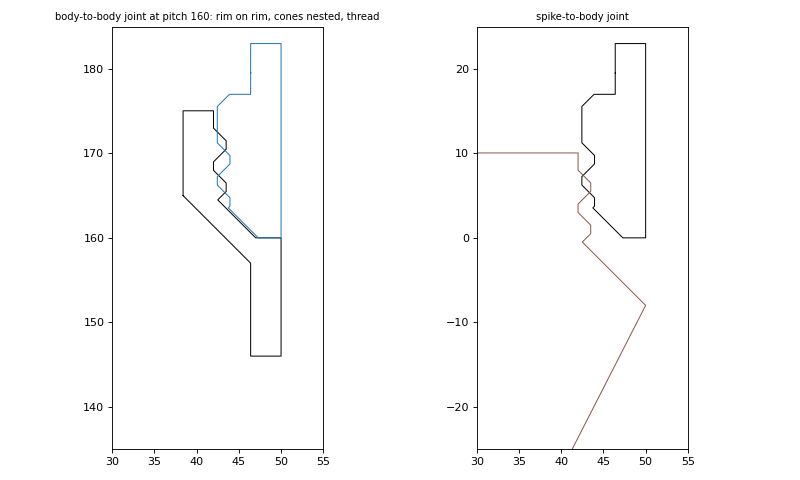
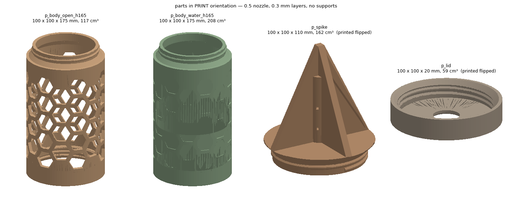
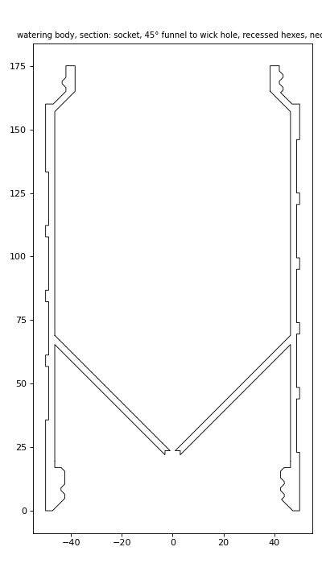
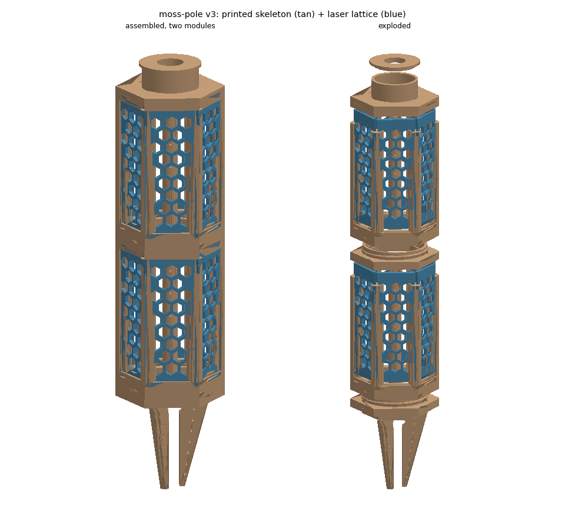
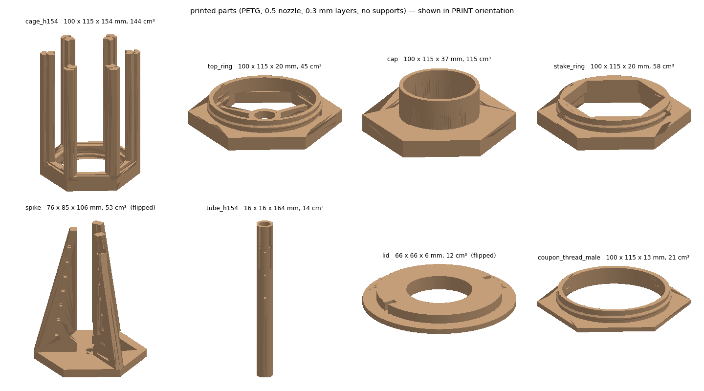
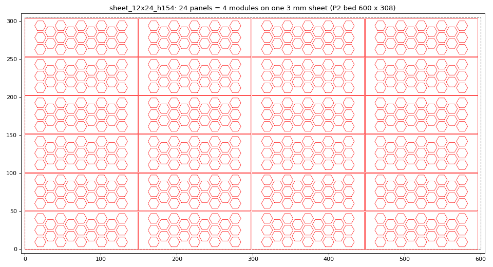

# moss-pole

Modular, self-watering, twist-together honeycomb moss pole, ~100 mm across.

Two tracks in this repo:

1. **Print-only** (`src/build_print.py` / `verify_print.py`) — start here. Four parts, the
   whole thing: spike, open body, watering body, lid. Everything
   screws together. This is what gets printed first.
2. **Hybrid** (`src/build_hybrid.py` / `verify_hybrid.py`) — the later iteration: laser-cut lattice
   panels in a printed skeleton. Same threads, same spike idea. Kept
   verified so it's ready when the laser joins in.

---

# Print-only set




`spike → body_open × N → body_water → lid`

| part | what it is | print |
|---|---|---|
| `stl/p_body_open_h165` | honeycomb tube, 21 mm openings, 14 columns, 4.5 mm struts, moss inside. Male neck up, female socket in the bottom | socket down, ~117 cm³ |
| `stl/p_body_water_h165` | same tube, hexes recessed not cut: a **~750 ml reservoir** inside the pole. A 45° funnel floor drains to a 6 mm wick hole that drips onto the moss below; the wick sets the rate (no pinhole to clog) | socket down, ~208 cm³ |
| `stl/p_spike` | four fins, hollow hub with side holes, male thread up. Screws into the first body | **tip up** (collar on the bed), ~162 cm³ |
| `stl/p_lid` | flat cap, fill hole, screws onto the top neck | **plate down**, ~59 cm³ |

**The joint.** Each body's top is a flat 3 mm rim and a short 45° cone into
the neck; each body's bottom (and the lid) has the matching cone recess.
Screw it home and rim seats on rim with the cones nested (0.3 mm clearance):
self-centering, no gap, no dirt trap, stiffer than the thread alone. The
female groove is phased to the male ridge so "thread home" and "rim seated"
are the same position. Module pitch is body height minus the 5 mm cone.






## Printing — 0.5 nozzle, 0.3 mm layers, no supports

Designed for it, not adapted to it:

- **Threads**: 5 mm pitch, 1.5 mm deep, true 45° flanks, 0.45 mm clearance.
  The ridge stays inside its collar (no nub past the end).
- **Every shoulder is a 45° cone**, outside (body → neck, spike shoulder) and
  inside (bore → neck bore). The socket ledge over the female thread is a
  45° cone too. There are no flat ceilings anywhere.
- **Hex openings are flat-top**, so each is an 8 mm bridge at the top and
  30°-from-vertical sides. The watering body's recesses are 1.2 mm (4 layers)
  on a 3.6 mm wall (7 perimeters); 2.4 mm stays.
- **Spike** prints tip-up: the collar bore floors into the hub channel at 45°,
  the channel closes at 45°, side holes are 2.7 mm squares. Use a brim; the
  footprint is a 12 mm wide ring.
- **Lid** prints plate-down; the fill-hole countersink faces the bed at 45°.

`verify_print.py` runs an overhang analysis on each part in its print
orientation (steep overhang < 60 mm², bridged area = the known short bridges)
and 32 measured joints: neck-in-socket crest/root clearance, engagement,
pitch match, socket open past the neck at collar height, spike and lid
threads, rim and cone geometry on both sides, wick hole, funnel clears the
neck below, spike bore-to-channel connected and side holes through, openings
cut through / recesses not, even column count and strut widths at the bore
and the outside, and finally **boolean intersection of every mated pair at
the seated position = 0 mm³**. That last test is what caught the thread
phase bug none of the radial measurements could see.

```bash
cd src
python build_print.py && python verify_print.py          # 165 mm bodies, Mini 2
MOSS_BODY_H=230 python build_print.py && MOSS_BODY_H=230 python verify_print.py --taz   # TAZ 2, ~1.2 L reservoir
python render_print.py                       # section drawings
LD_LIBRARY_PATH=<mesa>/lib PYOPENGL_PLATFORM=osmesa python render_gallery.py   # smooth-shaded galleries (pyrender + OSMesa)
```

## First prints

1. `p_lid` (fast) and the thread coupon from the hybrid set (`coupons.py`),
   to settle `TH_CLR`.
2. `p_body_open` — the long one. Socket down, brim, 15 s minimum layer time.
3. `p_spike`, `p_body_water`. Screw it all together, stuff moss, thread a
   6 mm cotton or polyester rope through the funnel hole, pour.

## Where the laser comes in later

The open body's wall is the only part with real detail. Iteration two swaps
the printed lattice for laser-cut panels in a printed skeleton (the hybrid
below): same threads, same spike, same lid, same watering body. Nothing
learned on the print-only set is wasted.

---

# Hybrid set (next iteration)

Modular, self-watering, twist-together honeycomb moss pole, ~100 mm across.
Laser-cut lattice panels in a 3D-printed skeleton. One design.



## The design in one paragraph

A module is a printed **cage** (base ring with a female thread, six slotted
corner posts, a spider for the water column) with six laser-cut **panels**
slid down the posts and a printed **top ring** that captures the panel tops
and carries the male thread. Modules screw together. A printed **stake ring** screws into the first
cage and holds a press-fit **spike** with hollow drip fins; a **cap** (a top
ring with a cup instead of a thread) sits on the last. A perforated **tube** runs up the axis
with a rope wick; an inverted soda bottle hangs in the cap's **lid**.

`spike + stake ring → cage → 6 panels → top ring → cage → 6 panels → … → cap`

## Parts

| part | make | per pole | what it joins |
|---|---|---|---|
| `laser/panel_h154` | laser, 3 mm sheet | 6 per module | J1 cage posts, J2 cage base slot, J3 top ring / cap slot |
| `stl/cage_h154` | print, ~132 cm³ | 1 per module | J1, J2 panels; J4 top ring thread; J5 stake thread; J6 tube |
| `stl/top_ring` | print, ~44 cm³ | 1 per module but the last | J3 panels; J4 next cage; J6 tube (spider) |
| `stl/cap` | print, ~115 cm³ (sparse infill) | 1 | J3 panels; J6 tube recess + wick; J7 lid |
| `stl/stake_ring` | print, ~56 cm³ | 1 | J5 first cage; J10 spike |
| `stl/spike` | print, ~53 cm³ | 1 | J10 stake ring; J6 tube; J8 water path |
| `stl/tube_h154` | print, ~14 cm³ | 1 per module | J6 top ring spider, spike recess, cap recess |
| `stl/lid` | print, ~12 cm³ | 1 | J7 cap cup, bottle |

Seven printed part types, one laser part. The verifier asserts that every part
appears in at least one measured joint.



## Sheet economics set the module height

The P2 bed is 600 × 308 mm. A panel ≤ 148 mm long fits four across a
12 × 24" sheet; 49.7 mm wide fits six down. `MODULE_H = 154` gives a 148 mm
panel, so one sheet is **24 panels = exactly four modules**, no waste. At 165
it would be 18 (three modules). The nest is written out as
`laser/sheet_12x24_h154.svg/.dxf`, kerf-compensated, 1 mm gaps.



## Audit — why each part exists, and what was removed

North star: modular, twist-on, honeycomb, self-watering,
spiked. Everything below either serves one of those or is gone.

| | verdict |
|---|---|
| lattice panel | the honeycomb skin; the laser's whole job |
| cage (ring + posts) | the bracket the panels slot into; makes the module rigid; carries the female thread |
| top ring | captures panel tops; carries the male thread = "twist on another segment" |
| stake with hollow fins | anchor and drip spike with water holes, all in one print |
| cap = top ring + cup | one part fewer in the stack than a threaded cap; no thread needed at the top |
| tube + wick + bottle lid | self-watering that can't clog (no pinhole); bottle is the reservoir |
| **pegs on the posts** | removed — six panels in slots already locate the top ring, and the pegs collided with the panel corners |
| **top-ring spider** | removed — the next cage's spider holds the tube |
| **Path L (all-sheet)** | removed — five-layer laminated rings are the opposite of elegant, and 14 part types |
| **v1 cylinder module** | removed — 7 hours of stringy printing per module vs 1 hour for a cage |

Left as a deliberate choice, not an omission: panel corners butt with a 1.3 mm
gap and are held only by the slots at both ends and the posts. A glue bead down
each post makes it permanent; it stands without one.

## Printability — 0.5 mm nozzle, 0.3 mm layers, no supports

Every part was reviewed as a print, not a model. What changed because of it:

| part | orientation | what the review caught | now |
|---|---|---|---|
| all threads | — | 3.5 mm pitch ridge had 54–70° flanks: unprintable coarse | pitch 5, depth 1.5, **true 45° flanks**, 0.45 clearance |
| cage | ring down, posts up | spider was three 30 mm bridges holding a floating hub; pocket had a 5 mm flat ceiling | spider moved to the top ring; 45° cone over the pocket; posts fattened |
| top ring | ring down | — | + spider, printed from the bed |
| cap | cup up | the plate over the ring's open centre was a 74 mm bridge | solid hex block: slicer infill carries the cup floor |
| stake | either way | fins-up hangs a 100 mm ring off a 42 mm collar; fins-down puts spike tips on the bed. **The plenum never actually connected to the fin voids** (1.6 mm of wall between them) | split: **stake ring** (ring down) + **spike** (plate down, fins up, on the hex corners); double-cone plenum that reaches the voids; 2.0 mm walls = 4 perimeters |
| tube | upright | round 2.5 mm side holes crown badly at 0.3 | 2.7 mm square holes (flat 2.7 mm bridges) |
| lid | flange down | — | — |

`verify_hybrid.py` now runs an overhang analysis on every STL in its print
orientation: total downward-facing area steeper than 44° from vertical must
be < 60 mm², and flat bridged area must equal the known bridges (slot
ceilings, drip holes, the stepped lip) within 150 mm². Plus: thread depth ≥ 3
layers, fin walls are whole perimeters, drip holes ≥ 2.4 mm.

The cage is still the hardest print: six 136 mm posts on a ring. Print two at
once or set a 15 s minimum layer time so PETG gets cooling on the towers.

## Verify

```bash
cd src
python build_hybrid.py     # stl/, laser/
python verify_hybrid.py    # 37 joints measured both sides, parts, envelopes, printability, nest
python coupons.py          # test prints for SLOT_W and TH_CLR
python render_hybrid.py    # docs figures
MOSS_MODULE_H=230 python build_hybrid.py && MOSS_MODULE_H=230 python verify_hybrid.py --taz   # TAZ 2 height (2 modules/sheet)
```

`verify_hybrid.py` lists every place two parts interlock, measures the feature on each
side from the built geometry (STL sections and cut polygons, not the
parameters), and asserts the clearance:

| joint | what is measured |
|---|---|
| J1 | panel thickness vs post slot width; panel width vs slot-to-slot length; post clears the panels' inner corner |
| J2 / J3 | slot depths in cage base, top ring, cap; slot widths; panel height vs base-slot-bottom-to-top-slot-top |
| J4 | top ring male crest vs cage female root; engagement depth; pitch match; collar vs pocket depth |
| J5 | stake ring thread vs cage; = top ring thread |
| J6 | tube OD vs top ring spider bore, spike recess, cap recess, open cage and stake ring, cap wick hole (must not pass); tube length = spider to spider |
| J7 | lid plug vs cup bore; PCO 1881 neck vs lid hole |
| J8 | recess → wick hole → plenum clear on axis; **plenum connects to fin void** (continuous empty run from the axis); drip holes through both walls; walls solid beside them |
| J10 | spike plate vs stake ring bore; plate stops on the lip; plate fits below the lip; fin roots stand on the plate |
| J9 | no strut thinner than STRUT; solid band ≥ slot depth |
| nest | every panel inside the bed, no overlaps, whole modules per sheet |

Earlier versions' joint registry caught three real bugs the renders had hidden
(panel 6 mm too tall, spline 24 mm short, pegs on the panel corners). That
history is in `archive/exploration/`.

## First session

1. **P2**: cut `sheet_12x24_h154` (24 panels) plus the archived kerf square and
   slot gauge if you want them, or just measure a panel with calipers.
2. **Mini 2**: `coupon_slot_gauge` (~10 min) and `coupon_thread_male/female`
   (~30 min). Set `SLOT_W` (measured sheet + 0.15 for friction, + 0.4 for slip)
   and `TH_CLR`. Rebuild, verify.
3. Print `cage_h154`, `top_ring`, `tube_h154`. Assemble one module.
4. Print `stake_ring`, `spike`, `cap`, `lid`. Assemble the pole. Water it.

## Parameters worth knowing

| | default | |
|---|---|---|
| `MODULE_H` | 154 | env `MOSS_MODULE_H`; 154 = 4 modules/sheet and Mini 2 safe |
| `SHEET_T`, `SLOT_W` | 3.0, 3.4 | measure your sheet |
| `KERF` | 0.20 | from a test square |
| `TH_PITCH`, `TH_DEPTH`, `TH_CLR` | 5, 1.5, 0.45 | coarse, 45° flanks; clearance from the thread coupon |
| `HEX_AF`, `STRUT` | 13, 2.5 | openings; roots need ≥ 12 |
| `PANEL_CLR` | 1.3 | corner gap; also sets the 49.7 mm width that nests six deep |
