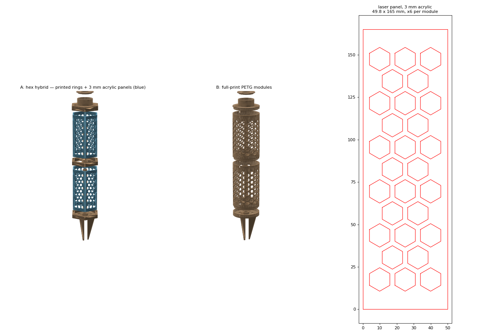
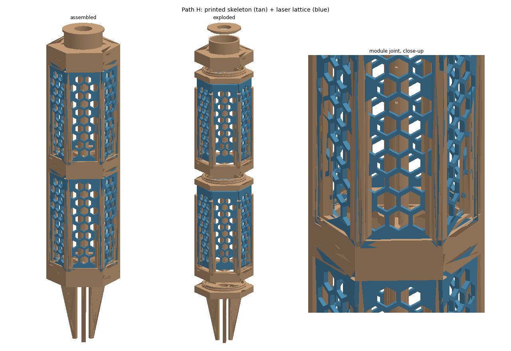
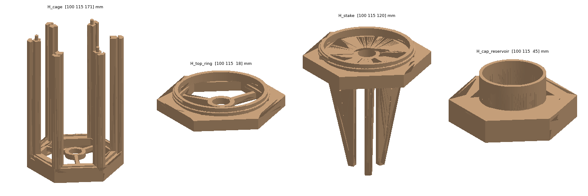
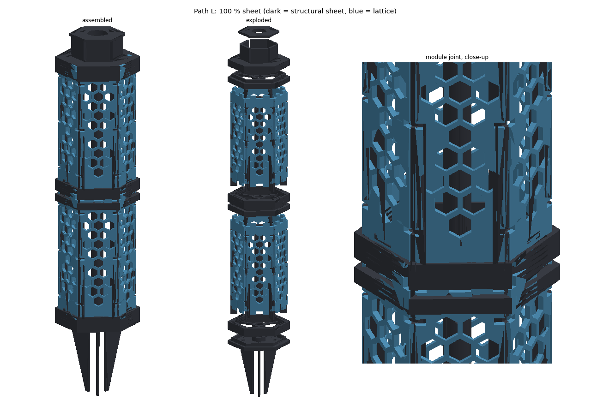
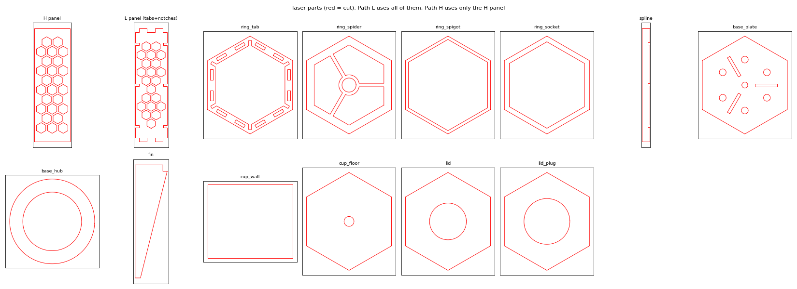
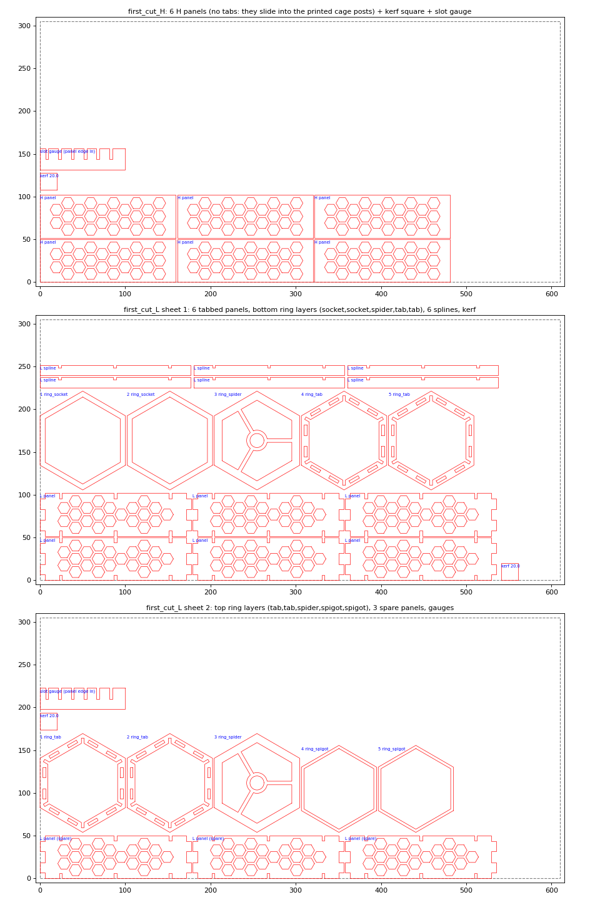
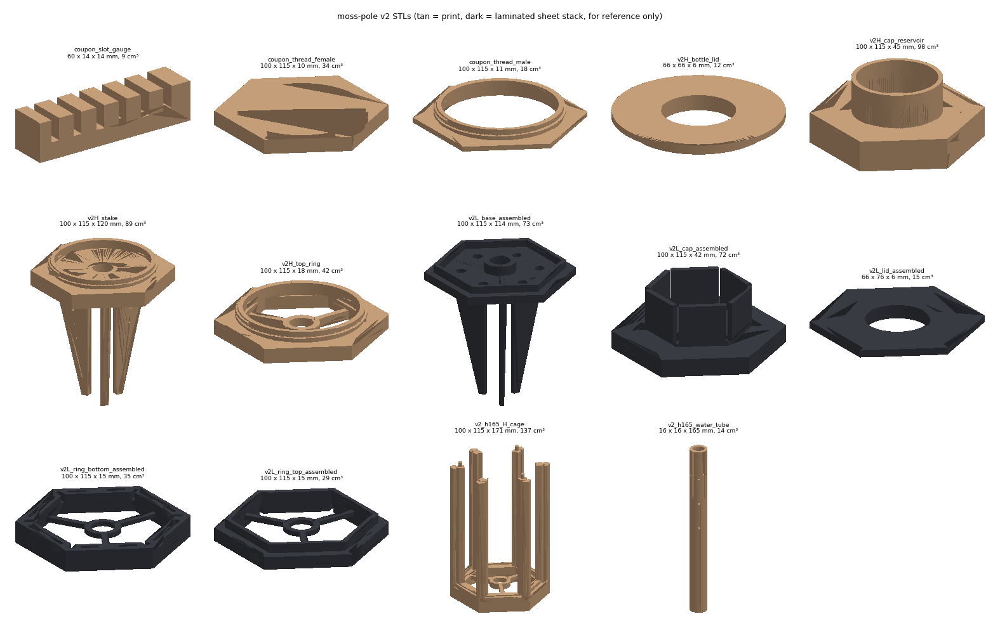

# moss-pole

Modular, self-watering moss pole, ~100 mm across (the "4 inch" size). Two
architectures built from one parameter set so they can be printed and
compared head to head before committing to either.



Design goals: PETG not PLA in wet moss, a real reservoir, anchoring, and
easy moss loading.

## The two architectures

| | **A — hex hybrid** | **B — full print** |
|---|---|---|
| lattice | 6 laser-cut 3 mm acrylic panels per module, dropped into slots | printed honeycomb cylinder, one piece per module |
| printed per module | one joiner ring (~35 cm³, ~1 h) + water tube | one module (~90 cm³ @165 mm, ~6–8 h) + water tube |
| lasered per module | 6 panels, ~2 min each on the P2 | — |
| module height | free — only the ring is printed | ≤ 165 mm on the Mini 2, ≤ 230 mm on the TAZ 2 |
| moss loading | lift a ring, pull a panel | stuff from the top |
| look | flat hex faces, crisp acrylic edges, engravable | round, matte, closer to the original |
| risk to test | panel/slot fit; does a slot-only joint feel stiff enough? | print time; hoop stiffness of a 3 mm perforated wall |

A ring serves as the top of one module *and* the bottom of the next, so a
pole is `stake → [6 panels, ring] × N → cap`. B stacks `stake → module × N → cap`
with a tapered spigot and three keys into rim notches (no rotation, pattern
lines up).

## Shared parts (both variants)

- **water column** — 16 mm perforated tube down the axis, module-length
  segments butting end to end through spider hubs in every ring/module.
  Run a cotton rope wick (6–8 mm) through the whole stack. Water reaches the
  moss along the full height, not just the top module.
- **reservoir cap** — a cup with a lid; an inverted soda bottle (PCO 1881
  neck) drops through the lid and hangs on its bead. Water level self-holds at
  the bottle mouth (chicken-waterer principle) and the wick draws from the
  cup. No orifice to clog, and the reservoir is whatever bottle you screw on.
  Two vent notches in the lid keep the cup at atmosphere — don't seal it.
- **stake base** — finned anchor 100 mm below the soil line with a drained
  floor and a locator hub for the bottom of the water column.

## Parts

| file | variant | count per pole | print notes |
|---|---|---|---|
| `v1_A_joiner_ring.stl` | A | N−1 | flat, no support; slots open on both faces |
| `v1_A_cap_reservoir.stl` | A | 1 | cup up |
| `v1_A_stake_base.stl` | A | 1 | print fins-up (inverted) |
| `laser/v1_h165_A_panel_3mm.{dxf,svg}` | A | 6 × N | 3 mm cast acrylic, red = cut |
| `v1_h165_B_module.stl` | B | N | upright, no support — openings are flat-top hexes so every edge is ≤ 30° from vertical with a ~8 mm bridge at the top |
| `v1_B_cap_reservoir.stl` | B | 1 | cup up |
| `v1_B_stake_base.stl` | B | 1 | fins-up |
| `v1_h165_water_tube.stl` | both | N | upright |
| `v1_bottle_lid.stl` | both | 1 | flange down |

`h230` versions of the module, tube and panel are also built (TAZ 2 only for
the B module). Print everything in PETG, 3 perimeters. A 0.6 nozzle is a good
idea for the B module.

## Build / verify

```bash
cd projects/moss-pole/src
python build_moss_pole.py                        # 165 mm modules (Mini 2)
MOSS_MODULE_H=230 python build_moss_pole.py      # 230 mm modules (TAZ 2)
python verify_moss_pole.py                       # Mini 2 envelope
MOSS_MODULE_H=230 python verify_moss_pole.py --taz
```

The verifier caught two real v1 bugs before anything was sliced: the panel
slots were cut on the hex *corners* instead of the faces, and the spider arms
in the joiner ring were aimed at corners and stopped 4 mm short of the wall
(a floating spider inside a "finished" STL). Both would have looked fine in a
render.

## Key parameters

| | | |
|---|---|---|
| `AF_OUT` | 100 | across flats (A) / OD (B) |
| `MODULE_H` | 165 / 230 | env `MOSS_MODULE_H` |
| `SLOT_W` | 3.4 | for nominal 3 mm acrylic (sheet runs 2.8–3.2 — measure yours) |
| `SPIGOT_CLR` | 0.45/side | B module fit; first thing to tune after a test print |
| `TUBE_CLEAR` | 0.6 | spider bore over the 16 mm tube |
| `CYL_HEX_AF`, `CYL_STRUT` | 14, 4 | B openings; 57 % open area |
| `PANEL_HEX_AF`, `PANEL_STRUT` | 12, 3 | A openings |
| `BOTTLE_NECK_D` | 28.6 | PCO 1881 thread OD 27.4 + clearance |

## v1 test plan

1. Print **one A joiner ring** and cut **one panel**. Check slot fit
   (`SLOT_W`) and whether the panel wants a detent to stay put.
2. Print **one B module at 165** on the Mini 2. Check the spigot fit against
   the stake socket (`SPIGOT_CLR`), and flex the wall.
3. Print the lid and check a real bottle: bead-to-mouth was assumed 17 mm —
   measure it and adjust `CUP_H` so the mouth sits 5–12 mm above the cup floor.
4. Then decide: A, B, or A-lattice-on-B-fittings.

## Deferred to v2

- bayonet / twist-lock instead of friction spigot (B) — once the fit is known
- a printed PCO 1881 thread on the cap so the bottle screws in (the lid
  hang-by-bead approach avoids threads for now)
- tie-off horns for stem ties on the rings / module bands
- optional half-shell (D-profile) variant for a flat-back pole against a wall

---

# v2 — two complete designs

v1 was the comparison rig. v2 is the two products, fully designed, from one
parameter set (`src/build_v2.py`, `src/verify_v2.py`). Concept rationale is
in [docs/concepts-v2.md](docs/concepts-v2.md).

## Path H — laser lattice, printed skeleton




| part | count / pole | print |
|---|---|---|
| `v2_h165_H_cage.stl` | 1 per module | base ring + 6 slotted posts + spider + 3 pegs, one print, ~94 cm³ |
| `v2H_top_ring.stl` | 1 per module | slots below, peg holes, male thread collar above |
| `v2H_stake.stl` | 1 | male thread, plenum under the column hub, **hollow fins with drip holes** |
| `v2H_cap_reservoir.stl` | 1 | female thread, cup, wick hole |
| `v2_h165_water_tube.stl` | 1 per module | as v1 |
| `v2H_bottle_lid.stl` | 1 | as v1 |
| `laser/v2_h165_H_panel.*` | 6 per module | 3 mm sheet, 13 mm openings, 2.5 mm struts, kerf-compensated |

Stack: stake → cage (screws on) → 6 panels slide down the posts → top ring
presses onto the pegs → next cage screws onto the collar → … → cap screws on.
Glue optional (epoxy bead down each post makes it permanent).

Thread: 84 mm root, 3.5 mm pitch, 1.5 turns, 1.6 mm deep, 0.35 mm radial
clearance female over male. First thing to tune after a test print.

## Path L — 100 % sheet




Every part is a 2D cut in `laser/v2L_*`. The `*_assembled.stl` files are the
laminates as they'd be glued, for checking and rendering only.

| part | count / pole | notes |
|---|---|---|
| `v2_h165_L_panel_tabbed` | 6 per module | tabs top and bottom (2 layers deep), 3 egg-crate notches per vertical edge |
| ring layers `ring_tab` ×2, `ring_spider`, `ring_spigot` ×2 or `ring_socket` ×2 | 5 per ring | top ring: tab, tab, spider, spigot, spigot. Bottom ring: socket, socket, spider, tab, tab |
| `v2_h165_L_spline` | 6 per module | 12 mm strip inside each corner, notched to match the panels at a 60° dihedral (notch = t/sin 60° + 0.3) |
| `base_plate` ×2, `base_hub`, `fin` ×3, `ring_spigot` ×2 | 1 set | fins tab into the plate; spigot on top mates the first module |
| `cup_wall` ×6, `cup_floor`, `lid`, `lid_plug`, `ring_socket` ×2, `ring_spider` | 1 set | the cap |

Rings are pre-laminated at cut time (the customer never glues a ring); the
module itself goes together with tabs and splines and needs no glue at all in
POM, or a drop of solvent on the tabs in acrylic.

## Build / verify

```bash
cd projects/moss-pole/src
python build_v2.py && python verify_v2.py            # 165 mm, Mini 2
MOSS_MODULE_H=230 python build_v2.py && MOSS_MODULE_H=230 python verify_v2.py --taz
python render_v2.py                                 # docs figures
```

`verify_v2` asserts thread engagement and clearance, peg/hole fit, slot
widths, tab/slot and spigot/socket fits, the spline notch geometry, that the
stake's column hole reaches the fin voids and the drip holes reach outside,
and printer envelopes.

## First prints / cuts

1. Path H: one cage + one top ring (thread fit, slot fit, post stiffness).
2. Six H panels (kerf, strut feel, opening size).
3. Path L: one bottom-ring laminate + six tabbed panels + six splines.
4. Stake, with water poured through it.

## Joint registry — every fit, measured on both sides

`src/verify_fits.py` lists every place two parts interlock (47 joints), measures
the feature on *each* side from the built geometry (STL sections, cut
polygons), and asserts the clearance. `--parts` prints what each part fits
into, which is its purpose as tested:

| part | joints |
|---|---|
| H panel | H1 thickness/width in cage post slots, H2/H3 height between base slot and top-ring slot |
| cage | H1 slots, H2 base slot, H4 pegs, H5/H6 female thread (top ring, stake), H8 spider bore |
| top ring | H3 slot, H4 peg holes, H5/H7 male thread (cage, cap), H8 spider bore |
| stake | H6 male thread, H8 hub bore, H10 column → plenum → fin void → drip holes |
| cap | H7 female thread, H8 wick hole (tube must *not* pass), H9 cup bore |
| tube | H8 all bores + length = module pitch, L6 base hub and spider layer |
| lid / bottle | H9, L7 plug in cup, PCO 1881 neck in hole |
| L panel | L1 tabs in ring_tab slots (width, thickness, 2-layer length), L2 notches ↔ spline (60° width, depth, count, assembled z) |
| spline | L2 notches ↔ panel, L3 thickness and outer edge in the ring corner notch, length = spider-to-spider |
| ring_tab / ring_spigot / ring_socket / ring_spider | L1, L3, L4 spigot in socket, L6 bore |
| fin / base_plate / base_hub | L5 tab thickness/length/height in plate slots, L6 bore |
| cup_wall / lid_plug | L7 wall width = hex side, plug in cup |

The registry found three real bugs on its first run that every render had
hidden: the H panel was 6 mm taller than the cage + top ring allow; the L
spline was 24.5 mm short with its notches 12 mm off; and the pegs sat exactly
where the two panel edges meet at each corner. Plus one geometric flaw: the
L panel's notches cut into lattice openings (now kept clear).

```bash
python verify_fits.py            # table of all joints, exit 1 on any failure
python verify_fits.py --parts    # plus the part -> joints listing
```

## First session files




Three 12 × 24" sheets, each nest-checked (inside the sheet, no overlaps):

- `laser/first_cut_H_12x24` — six H panels (no tabs: they slide into the cage
  posts), kerf square, slot gauge. Path H needs nothing else from the laser.
- `laser/first_cut_L_sheet1_12x24` — six tabbed panels, six splines, the five
  bottom-ring layers in stacking order, kerf square.
- `laser/first_cut_L_sheet2_12x24` — the five top-ring layers, three spare
  panels, gauges. Sheets 1 + 2 = one complete Path L module.

Printed coupons: `coupon_slot_gauge.stl` (slots 3.2–3.7, ~10 min) and the
`coupon_thread_male/female.stl` pair (~30 min). Then set `KERF`, `SLOT_W`,
`TH_CLR`; rebuild; print `v2_h165_H_cage.stl` + `v2H_top_ring.stl`.
